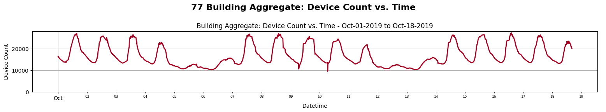

# Modeling People Movement


**OVERVIEW:** This project takes a dynamical systems approach to modeling the flow of people on a public campus. Everything is explained in the Jupyter Notebooks and will be updated over the next few months. 



## Workflow

1. **Processing Procedure**
    - Dataset Introduction: Campus WiFi
    - The `DataProcessor` Class
    - Class Methods
    - Optional Parameters
    - Speed-up: Parallel Data Processing
    - Performance Testing and Results

2. **Data Visualization**
    - Time-Series Visualization
    - The `DataVisualization` Module
    - Classes in this Module
        - The `DataVisualizer` Class
        - The `InteractiveVisualizer` Class

3. **Matrix Decompositions**
    - SVD
    - Truncated-SVD
    - NMF
    - TSNMF

4. **Sparse Indentification of Nonlinear Dynamics**

### Directory Information

```bash
/ModelingPeopleFlow
    .env
    .vscode

    /data
        /images
            /3d
            /matrix-fact
            /speed-up
            /time-series
            /wordcloud

        /input
            /configs
            /coords
                campusCoords.json
                engineeringCoords.json

            /events
                event_dict.py  

            /png_files
                main_campus.png
                east_campus.png
                engineering_quad.png

            /WiFiData-old
                /Eduroam
                /UCBGuest
                /UCBWireless

            /WiFiData-new

        /output
            /building-plots
                /all-buildings
                    sparsity_3networks-AllData.png

                /chunks
                    /normalized
                        "%b-%d-%Y"_to_"%b-%d-%Y"
                            /svd
                            /trunc-svd
                            /nmf
                            /tsnmf

                    /special
                    /time-series

                /single
                    /normalized
                    /time-series
                    /interval

            /campus-plots
        /references
        /tables
        README.md
    
    /notebooks
        DataAnimator.ipynb
        DataDecompositions.ipynb
        DataVisualization.ipynb
        MAIN.ipynb
        TEST.ipynb
                    
    /src
        /python
            /data_plotter
                sparsity_plotter.py
                bar_charts.py

            /decomps
                nmf.py
                svd.py

            /processor
                config_manager.py
                data_processor.py
                sparsity.py
            
            /sindy

            /time_series
                creator.py
                event_plotting.py
                plot_builder.py

            /gui
                launcher.py

    .gitignore
    config.json
    config2.json
    README.md
    requirements.txt
```

### Acknowledgement

Built as a side project during summer 2023 by Tyler Reiser. This code has never been run on CU Research Computing resources - the goal was to build a system that could process WiFi information reports for the entire campus, eventually running it continuously on the Alpine supercomputing cluster.

### Funding

This is a work in progress and a side-project that is not currently funded. If you are interested in helping me, Tyler Reiser, find funding for this project, or if you would like to fund this project or want to help and become friends, please reach out. Thanks.

---

CREATED:        SEPTEMBER   2023  
MODIFIED:       NOVEMBER    2024

COPYRIGHT (c) 2024 Tyler A. Reiser
